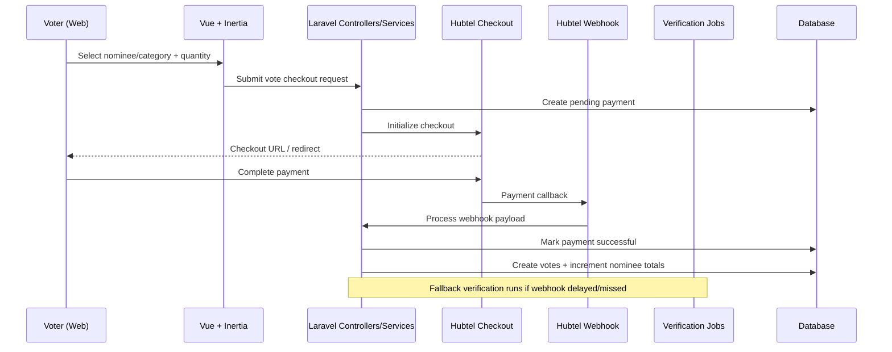
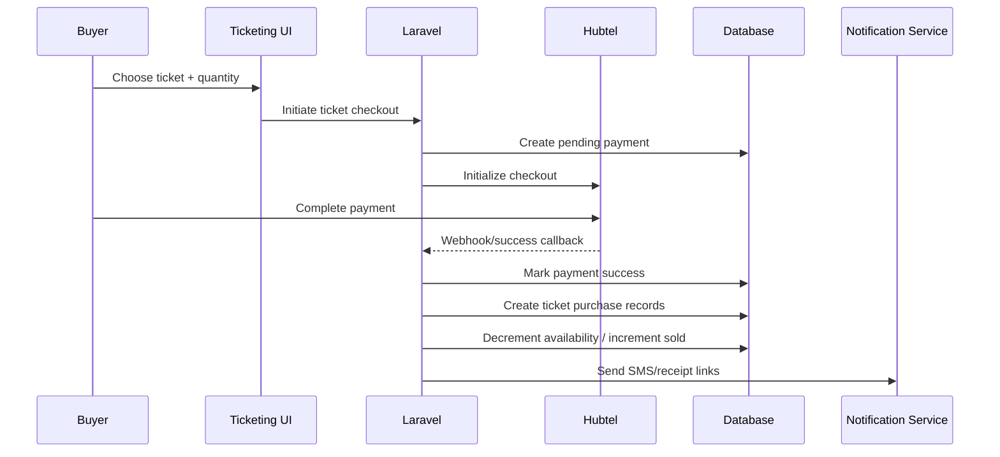
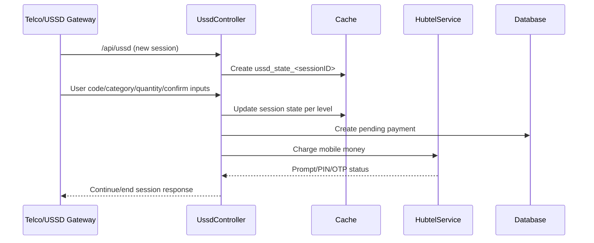

# Event-Crypt Voting App — System Architecture

## 1) Context and goals

Event-Crypt Voting App is a **multi-tenant event platform** where many organizations can run independent award voting and ticketing events in a single Laravel application.

Primary goals:
- Enable organization-scoped voting and ticketing at scale.
- Support both **web** and **USSD** voter journeys.
- Provide reliable payment processing with webhook and reconciliation fallbacks.
- Support real-time operational workflows (admin verification, payout operations, analytics).

---

## 2) System type and high-level architecture

### System type
- Multi-tenant SaaS-like platform (single app, multiple organizations/events).
- Domain modules: voting, ticketing, payments, USSD, notifications, admin operations.

### Core stack
- **Backend:** Laravel 12 (PHP 8.2+), monolith architecture.
- **Frontend:** Vue 3 + TypeScript + Inertia + Vite.
- **Admin:** Filament (organization panel and super-admin panel).
- **Data:** PostgreSQL in production, SQLite in local/dev.
- **Queue/Scheduler:** Laravel queue (database driver), scheduler-driven reconciliation jobs.
- **Caching:** Laravel cache (database default; Redis optional).
- **Media:** Cloudinary integration.

---

## 3) Component architecture

```mermaid
flowchart LR
    subgraph Clients
      WEB[Web Browser\nVoting/Ticketing]
      USSDGW[USSD Gateway/Telco]
      ADMIN[Admin/Super Admin\nFilament UI]
    end

    subgraph App[Laravel Monolith]
      ROUTES[Routes + Middleware]
      CTRL[Controllers]
      SVC[Domain Services\n(Hubtel, Voting, Receipt, Notifications)]
      JOBS[Queue Jobs + Scheduler]
      MODELS[Eloquent Models + Scopes]
      CACHE[(Cache Store)]
    end

    subgraph Data
      DB[(PostgreSQL / SQLite)]
    end

    subgraph External
      HUBTEL[Hubtel APIs\nCheckout/Status/Send Money]
      PAYSTACK[Paystack APIs\nLegacy/parallel support]
      SMS[SMS Providers\nHubtel/Arkesel]
      CLOUD[Cloudinary]
      CI[GitHub Actions CI]
    end

    WEB --> ROUTES
    ADMIN --> ROUTES
    USSDGW --> ROUTES
    ROUTES --> CTRL --> SVC --> MODELS --> DB
    CTRL --> CACHE
    SVC --> CACHE
    SVC --> HUBTEL
    SVC --> PAYSTACK
    SVC --> SMS
    SVC --> CLOUD
    JOBS --> SVC
    JOBS --> DB
    JOBS --> HUBTEL
    CI --> App
```

---

## 4) Tenant and data boundaries

### Multi-tenant boundary model
- Core tenant root: **Organization**.
- Organization owns one or more **Events**.
- Event owns voting and ticketing entities:
  - Award categories (main/sub), nominees, votes.
  - Tickets, ticket purchases, payments.

### Enforced boundaries
- Route model binding scoped by organization slug for public organization routes.
- Organization/event ownership checks in controllers.
- Model-level global scopes in key models (e.g., payments, ticket purchases).
- Filament panels and dashboard queries scoped to organization context.

---

## 5) Main channels

### Web voting/ticketing channel
Browser → Laravel routes/controllers → Hubtel checkout redirect → Hubtel webhook / success verification → fulfillment (votes/tickets).

### USSD channel
USSD gateway/telco → `/api/ussd` → cache-backed session state machine (`ussd_state_*`) → mobile money charge via Hubtel → user prompt/confirmation response.

### Admin operations channel
Filament organization/super-admin panels for:
- Event and category configuration.
- Nominee management.
- Payment monitoring.
- Ticket verification/check-in workflows.

### Public ticket validation channel
Public route `/t/{ticketCode}` renders ticket details and QR payload.
Admin scanner verifies ticket and performs check-in.

---

## 6) Critical business flows

## 6.1 Web voting flow



## 6.2 Ticket purchase flow



## 6.3 USSD voting flow



## 6.4 Hubtel payment reliability flow
- Primary completion path: Hubtel webhook (`/api/webhook/hubtel`).
- Secondary completion path: success-page verification (`PaymentSuccessController`) using Hubtel transaction status endpoint.
- Background reconciliation:
  - `VerifyPaymentStatus` (delayed per-transaction check).
  - `VerifyPendingPayments` (scheduled sweep for stale pending payments).

This layered approach reduces lost-payment risk and improves eventual consistency.

## 6.5 SMS notification flow
- Notification channel abstraction via `SmsDriver` contract.
- Provider implementations include Hubtel SMS and Arkesel SMS.
- Driver selected through config/env binding.
- SMS sent for successful vote and ticket confirmation scenarios.

## 6.6 QR and ticket verification flow
- QR payload is the public ticket URL (`/t/{ticketCode}`).
- Frontend generates QR client-side.
- Organization verification UI scans QR using `html5-qrcode`.
- Scanner resolves ticket and marks checked-in if valid and event active.

---

## 7) API and integration boundaries

### Public-facing API endpoints
- `POST /api/ussd`
- `POST /api/webhook/hubtel`
- `POST /api/webhook/paystack`

### Webhooks
- Webhook endpoints are explicitly excluded from CSRF validation.
- Signature validation is implemented for Paystack webhook handling.

### External integrations
- **Hubtel:** checkout, transaction status, mobile money charge/send money, SMS.
- **Paystack:** webhook and payment handling paths for legacy/parallel support.
- **Arkesel:** optional SMS provider.
- **Cloudinary:** media storage and delivery.

---

## 8) Security and reliability controls

### Security controls
- Vote initiation rate limiting by IP and email.
- Idempotency guards on payment fulfillment paths:
  - Payment status checks (`isSuccessful`).
  - Usage checks (`hasBeenUsedForVoting`, `hasBeenUsedForTicketing`).
- Organization/event ownership checks in request handling.
- Auditing enabled on key financial records (payments).

### Reliability controls
- Multi-path payment verification (webhook + success page + queued reconciliation).
- Cached USSD state with short TTL for session resilience.
- Scheduled background job for pending payment verification.
- Queue-backed asynchronous processing for delayed verification workloads.

---

## 9) Deployment topology and CI/CD

## 9.1 CI pipeline (GitHub Actions)
- **`tests.yml`**
  - Checkout, setup PHP/Node, install dependencies, build assets, run Pint.
- **`lint.yml`**
  - Install dependencies, run Pint, frontend format, and frontend lint checks.

## 9.2 Deployment pipeline (`deploy.sh`)
- Pull latest code from `main`.
- Install/update Composer dependencies.
- Install npm dependencies when needed.
- Build frontend assets.
- Run database migrations.
- Clear/cache optimize Laravel caches.
- Reset permissions and restart PHP-FPM + Nginx.

## 9.3 Runtime topology (current)
- Nginx + PHP-FPM serving Laravel app.
- Queue worker process(es) for async jobs.
- Scheduler for recurring reconciliation tasks.
- Database-backed cache/session/queue by default; Redis can be enabled.

---

## 10) Observability and operational considerations

Current observability pattern relies heavily on application logs across controllers, services, and jobs.

Recommended operational baseline:
- Structured log aggregation and alerting for payment failures and webhook anomalies.
- Dashboards for payment status latency, reconciliation rates, and check-in throughput.
- Tracing around external provider calls to Hubtel/Paystack/SMS.

---

## 11) Risks and future improvements

### Known risks
- Monolithic fulfillment logic appears in multiple execution paths, increasing drift risk.
- Payment provider callback behavior variability can delay final consistency.
- Database cache/queue defaults may limit high-throughput performance.

### Recommended improvements
- Move fulfillment to a single event-driven workflow with stronger idempotency keys.
- Strengthen webhook authenticity guarantees for all providers.
- Shift cache/queue to dedicated Redis infrastructure in production.
- Introduce centralized observability (metrics, traces, alerting).
- Consider outbox/inbox patterns for external payment event processing.

---

## 12) Quick reference: key implementation touchpoints

- Routing and middleware:
  - `/home/runner/work/Voting-App/Voting-App/routes/web.php`
  - `/home/runner/work/Voting-App/Voting-App/routes/api.php`
  - `/home/runner/work/Voting-App/Voting-App/bootstrap/app.php`
- Payments and verification:
  - `/home/runner/work/Voting-App/Voting-App/app/Services/HubtelService.php`
  - `/home/runner/work/Voting-App/Voting-App/app/Http/Controllers/PaymentSuccessController.php`
  - `/home/runner/work/Voting-App/Voting-App/app/Jobs/VerifyPaymentStatus.php`
  - `/home/runner/work/Voting-App/Voting-App/app/Jobs/VerifyPendingPayments.php`
- USSD:
  - `/home/runner/work/Voting-App/Voting-App/app/Http/Controllers/UssdController.php`
- Ticketing + QR:
  - `/home/runner/work/Voting-App/Voting-App/app/Http/Controllers/PublicTicketController.php`
  - `/home/runner/work/Voting-App/Voting-App/resources/js/components/QRCodeDisplay.vue`
  - `/home/runner/work/Voting-App/Voting-App/resources/js/organization-ticket-scanner.ts`
- Notifications/SMS:
  - `/home/runner/work/Voting-App/Voting-App/app/Providers/AppServiceProvider.php`
  - `/home/runner/work/Voting-App/Voting-App/app/Services/Sms/HubtelSmsDriver.php`
  - `/home/runner/work/Voting-App/Voting-App/app/Services/Sms/ArkeselSmsDriver.php`
- CI/CD:
  - `/home/runner/work/Voting-App/Voting-App/.github/workflows/tests.yml`
  - `/home/runner/work/Voting-App/Voting-App/.github/workflows/lint.yml`
  - `/home/runner/work/Voting-App/Voting-App/deploy.sh`